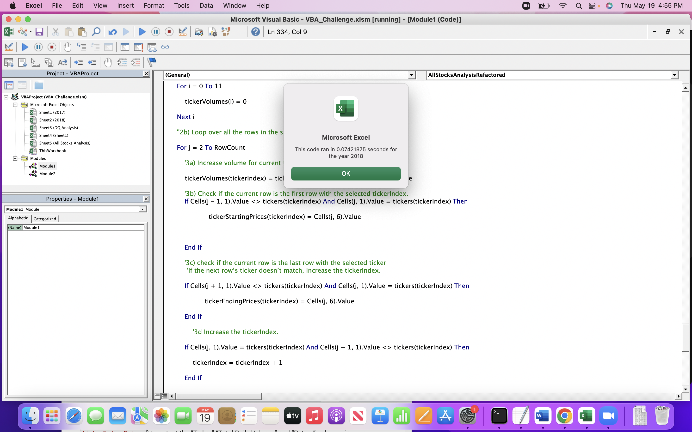

# stock-analysis

## Overview of Project
### Purpose
The goal of the stock analysis in general is to analyze a handful of green energy stocks for investment purposes. The stock data is stored in Excel files and we use Visual Basic for Applications (VBA) to automate the tasks of the various analyses. We also refactor the code to make it more efficient by reducing the number of steps, using less memory or improving the logic of the code.

## Results
### Stocks Performance

        

Based on the results of all the stocks in 2017, we can see that only one stock dropped and that is by 7.2% and the other stocks increased during the year.

 

Based on the results of All Stocks in 2018, we can see that only two stocks have increased over the year and the rest of stocks have dropped.

### Execution times

Above are the execution times of refactored Script.

Above are the execution times of the Original Script

We can easily see that the refactored Script has a better running time than the original Script!

## Summary
### Advantages or disadvantages of refactoring code

Among the many advantages of refactoring code, we have that the code becomes easier to understand and to read. The code becomes less complex and easier to maintain. It helps future programming easier and saves time and money for that matter. 

Among the disadvantages of refactoring a code, there is the fact that it can be time consumming, especially for big program. 

### Pros and Cons apply to refactoring the original VBA script?

The pros to refactor the original VBA script is that we eliminate code smells like duplicate Code and Lack of Design. Another Pro is that our code becomes reusable for the future. It also becomes easily readable and debugg becomes also easy. The code is also time efficient.

The Cons are that refactoring a code may take longer when we have a larger code. It can be time consuming, therefore costs a lot of money. 
