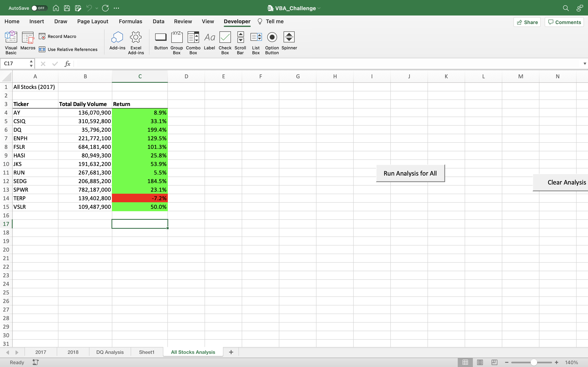

# stock-analysis

## Overview of Project
### Purpose
The purpose of the stock-analysis in general is to analyze a handful of green energy stocks for investement purpose. The stocks data are stored in Excel files and we use Visual Basic for Applications(VBA) to automate tasks for different analyses. We also refactor the code to make it more efficient by taking fewer steps, using less memory, or improving the logic of the code.

## Results
### Stocks Performance

         

Based on the results of All Stocks in 2017, we can see that only one stock dropped 7.2 % and other stocks have augmented over the year.

    

Based on the results of All Stocks in 2018, we can see that only two stocks have augmented over the year and the rest of stocks have dropped.

### Execution times

Above are the execution time of refactored script.

